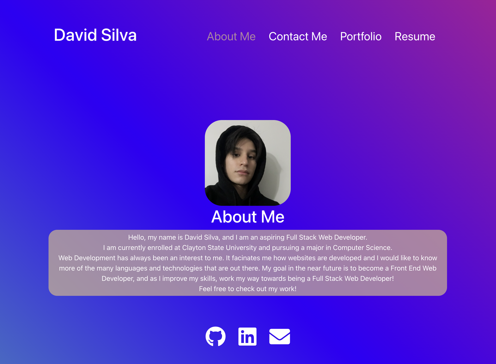

# React Portfolio


## Description

A portfolio created using React.

## Table of Contents

- [Installation](#installation)
- [Usage](#usage)
- [Links](#links)
- [License](#license)
- [Tests](#tests)
- [Questions](#questions)

## Installation

1. clone repo

## Usage



## Links


## License

This project is license under Apache-2.0

## Tests

```
npm install
```

```
npm start
```

## Questions

If you have any questions, please email me at isthatsilva@gmail.com.